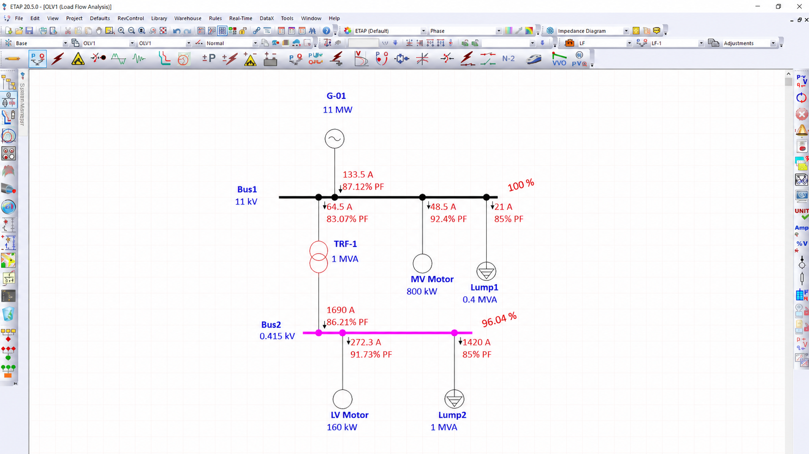

# ETAP-Based Load Flow and Protection Analysis of an 11 kV / 0.415 kV Industrial Distribution System

## Project Overview

This project focuses on the modeling and load flow analysis of an industrial electrical distribution system using ETAP 20.5. The system consists of an 11 kV incoming grid source, 1 MVA transformer, MV/LV motor loads, and industrial lumped loads connected through a 0.415 kV distribution network.

The objective of the study is to evaluate bus voltage profile, feeder loading, power factor characteristics, and operational behavior of a transformer-fed industrial power distribution system under steady-state operating conditions.

# Single Line Diagram & Load Flow Analysis

# Key Components

- 11 kV Grid Source
- 1 MVA Transformer
- 11 kV and 0.415 kV Buses
- MV/LV Motor Loads
- Distribution Feeders
- Industrial Lumped Loads

# Analysis Performed

## Load Flow Analysis
- Bus voltage profile evaluation
- Feeder loading analysis
- Current flow analysis
- Power factor analysis
- Steady-state operating condition study

## Protection & Fault Study
- Basic short-circuit analysis
- Fault current study
- Selective isolation concept
- Industrial protection system fundamentals

# Software Used

- ETAP 20.5
- Load Flow Analysis
- Single Line Diagram (SLD)
- Industrial Distribution System Modeling

# Applications

- Industrial Power Distribution
- Process Plant Electrical Systems
- Electrical Maintenance
- Industrial Reliability Studies

# Author

Akshay Kumar Jha  
Electrical Engineering Undergraduate  
National Institute of Technology Agartala
